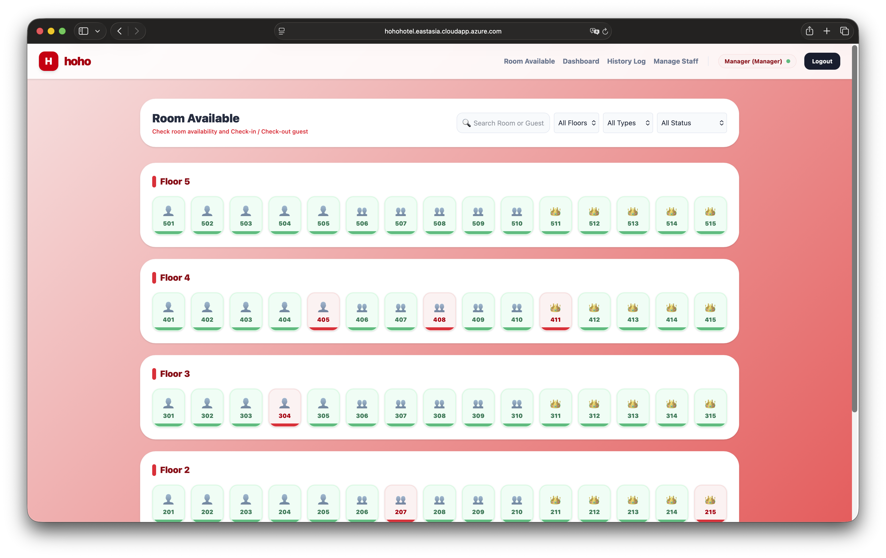
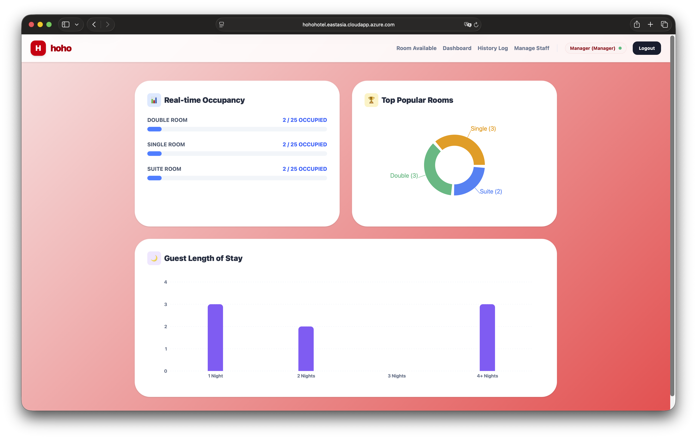
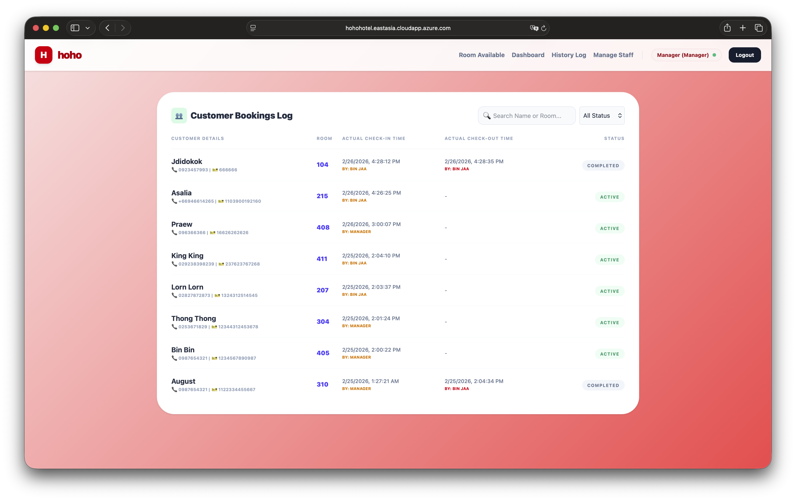

# hoho | Hotel Management System

**hoho** is a comprehensive hotel front-desk and reservation platform designed to streamline property operations. Built with a modern tech stack, it provides real-time visibility into room status, secure guest registration, and administrative oversight.

## Team Members

- **Kusol Mahasinananda** : ([GitHub](https://github.com/AuguAu))
- **Siah Wen Bin** : ([GitHub](https://github.com/Prohere7321))
- **Chanyuphyea Lorn** : ([GitHub](https://github.com/yuphyealorn-ops))

## Project Description

Developed as a specialized solution for mid-sized hotels, **hoho** manages 75 rooms across 5 floors. The system is built on a 3-entity architecture (Rooms, Bookings, and Staff Users) to ensure seamless data flow and high accountability.

### Key Features

- **Real-time Reception Desk:** Interactive grid showing Available/Occupied status for 75 rooms.
- **Role-Based Access Control (RBAC):** Distinct interfaces for **Managers** (full access) and **Receptionists** (front-desk operations).
- **Staff Accountability Log:** A transparent history log that tracks every transaction with the specific staff member's name.
- **Analytics Dashboard:** Visualized occupancy rates, room popularity (Pie Chart), and guest length-of-stay (Bar Chart).
- **Security & Integrity:** Strict input validation (20-digit limits) and date-logic checks to prevent invalid reservations.

## Tech Stack

- **Framework:** Next.js 15
- **Database:** MongoDB Atlas (Mongoose ODM)
- **Styling:** Tailwind CSS v4
- **Visualization:** Recharts

## Screenshots

### Login page

### Room Available page

### Dashboard page

### History Log page

### Staff Management page (Only Manager role can access)

## Live Demo

[Click here to view App](https://hohohotel.eastasia.cloudapp.azure.com)

### Login Credentials

| Role         | Username | Password    |
| ------------ | -------- | ----------- |
| Manager      | manager  | manager_pwd |
| Receptionist | staff_1  | staff_1_pwd |

## Note

** This application is developed for only academic purposes at VMES @ AU (ITX4107_Project2) **
